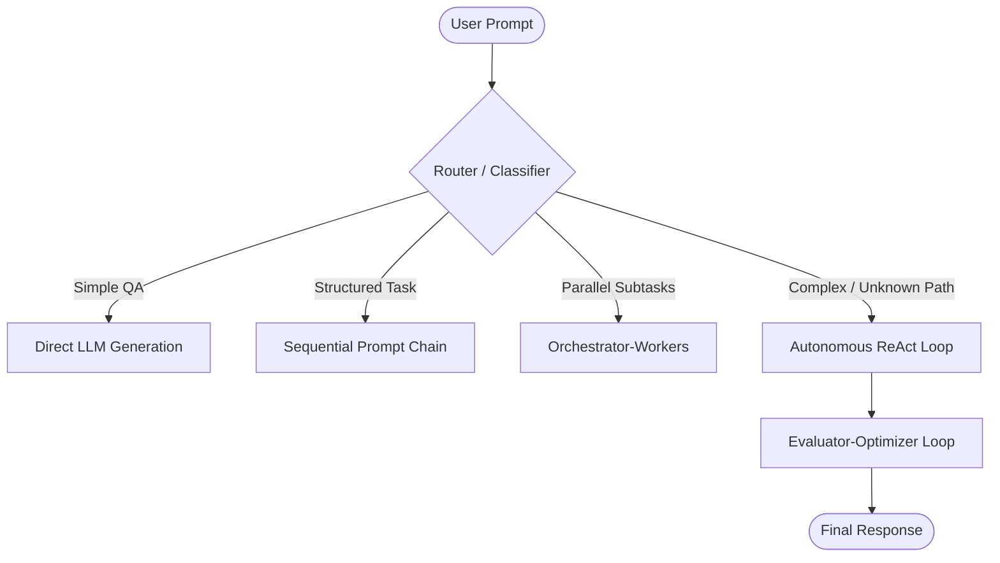

# Architecture & Design Patterns Skill

Comprehensive guide for designing modular, decoupled, and maintainable software architectures and agentic AI systems.

---

## 1. SOLID Principles in AI & Agent Systems

| Principle | Meaning & Python/AI Application | Implementation Pattern |
| :--- | :--- | :--- |
| **S - Single Responsibility** | A module/class should have only one reason to change. | Separate `config.py` (env/logging), `tools.py` (tool logic), `models.py` (LLM factories), `runner.py` (orchestration). |
| **O - Open / Closed** | Open for extension, closed for modification. | Add new tools to a tool registry or new agent nodes without changing existing execution loops. |
| **L - Liskov Substitution** | Derived classes/implementations must be substitutable for base types. | All tools implement `BaseTool`, all chat models implement `BaseChatModel`. Any LLM provider can replace another without breaking agent logic. |
| **I - Interface Segregation** | Clients should not depend on interfaces they do not use. | Use small, focused Protocols (e.g., `MessageFormatter`, `TokenCounter`) instead of monolithic fat interfaces. |
| **D - Dependency Inversion** | Depend on abstractions, not concrete implementations. | High-level runners receive `BaseChatModel` and `Sequence[BaseTool]` injected from the composition root (`main.py`). |

---

## 2. Core Software Design Patterns

### A. Factory & Composition Root
Keep object instantiation centralized in a single composition root (`main.py`):
```python
# Composition Root
def build_application():
    config = load_configuration()
    model = get_model_provider(config.provider_name)
    tools = get_registered_tools()
    runner = AgentRunner(model=model, tools=tools)
    return runner
```

### B. Adapter Pattern
Wrap external third-party APIs or legacy functions into standardized tool interfaces conforming to LangChain's `@tool` protocol:
```python
class ExternalAPIService:
    def fetch_data(self, query: str) -> dict: ...

# Adapter
@tool
def search_adapter(query: str) -> str:
    """Standardized search tool adapting ExternalAPIService."""
    service = ExternalAPIService()
    result = service.fetch_data(query)
    return str(result)
```

### C. Strategy Pattern
Switch execution strategies (e.g., direct reasoning vs. multi-step tool calling vs. RAG retrieval) dynamically:
```python
from typing import Protocol

class ExecutionStrategy(Protocol):
    def execute(self, user_prompt: str) -> str: ...

class DirectChatStrategy:
    def execute(self, user_prompt: str) -> str:
        return model.invoke(user_prompt).content

class ToolAgentStrategy:
    def execute(self, user_prompt: str) -> str:
        return agent.invoke({"messages": [("user", user_prompt)]})
```

---

## 3. Agentic Workflow Architecture Patterns

When designing LLM systems, choose the simplest pattern that solves the task reliably:



1. **Prompt Chaining**: Linear pipeline where the output of step $N$ becomes input to step $N+1$. Best for structured, fixed-step transformations.
2. **Routing**: An initial lightweight model classifies user intent and routes the query to specialized sub-agents or toolsets.
3. **Parallelization**: Running independent LLM calls concurrently (e.g., summarizing multiple documents or voting among multiple reasoning paths) and aggregating results.
4. **Orchestrator-Workers**: A central orchestrator LLM breaks a complex problem into sub-tasks, dispatches them to worker agents, and synthesizes the outputs.
5. **Evaluator-Optimizer**: A generator model produces a draft, a discriminator/evaluator model critiques it against quality criteria, and the generator iteratively refines the output.
6. **Autonomous ReAct**: The agent dynamically reasons, selects tools, observes environment feedback, and iterates until the goal is satisfied.

---

## 4. Clean & Hexagonal Architecture (Ports & Adapters)

Organize codebases into concentric layers:

```text
Domain Layer (Core Entities, Value Objects, Domain Logic - No LLM Dependencies)
       ↑
Application Layer (Use Cases, Agent Workflows, Orchestration)
       ↑
Infrastructure Layer (Adapters: Groq, Google GenAI, Databases, File System, Tools)
```

- **Domain/Core**: Pure Python, zero framework dependencies.
- **Ports**: Abstract interfaces (`Protocol` or `ABC`) defining what the application requires.
- **Adapters**: Concrete implementations (LangChain, Groq API, file loggers, SQL databases).
